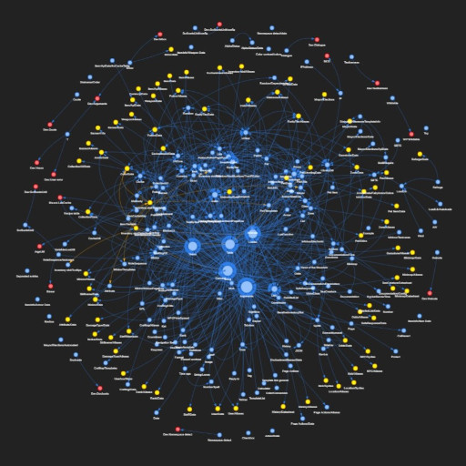
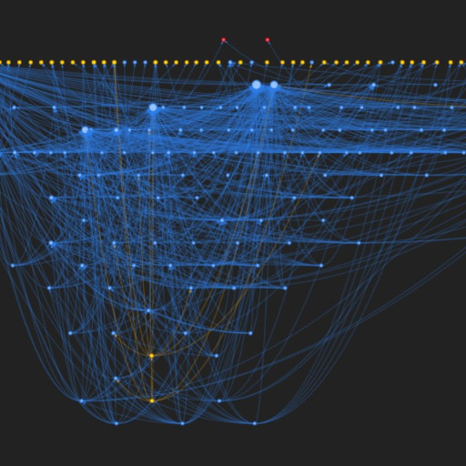

# Module Dependency Visualization

This is a fun project to build a graph visualization for the module dependencies of Hypixel SkyBlock Wiki.

You can view the demo on:  
https://monkeyshk.github.io/BuildModuleNetwork/default.html  
https://monkeyshk.github.io/BuildModuleNetwork/hierarchical.html  

## Screenshots




## Structure

The source files are in the `src` directory. The generated intermediate files are in the `build` directory. The generated HTML files is in the `docs` directory.

## Running

Set up environment. If conda is used, run:

```
conda create -n buildmodulenetwork python=3.12 -y
conda activate buildmodulenetwork
conda install --file requirements.txt -y
```

First, generate the module dependency graph information:

```
python src/makegraph.py
```

This updates the intermediate files in the `build` directory.

Then, generate the HTML files:

```
python src/buildnetwork.py
```

This updates the HTML files in the `docs` directory.

## How It Works

With a user-defined list or an API requested list of all module pages as starting pages, using BFS, the program crawls through its dependencies, dependencies of dependencies, and so on.

To get the dependencies, the program first requests the page content using MediaWiki's API, then detects its module dependencies. The detection of module dependencies is solely string pattern detection based on how wiki users import their modules.

The module types are also detected. A module is categorized as a data module if it is imported with `loadData` at any time. A module is categorized as an external module if the page cannot be found on the wiki.

After that, it builds the nodes and edges in a directed graph following the USES and COMPRISES relation. Note that this program cannot differentiate between USES and COMPRISES relations. We call all of them USES relations for convenience. If module A imports (USES) module B, an arrow points from A to B.

The nodes are colored differently based on their types (module, data module, external module). The size of the node is proportional to on the number of modules that USES it.

The node levels are calculated to support the hierarchical version. Here, a node is at level N if all its outgoing neighbors are at no more than level N-1, among which at least one is at level N-1. Non-external modules that do not USE any other non-external module have nodes at level 0. External module nodes are at a special level of -1.

## Changelog

| Version | Changes |
| ------- | ------- |
| 1.4 | Use dark mode. Add hierarchical version. The arrow direction is reversed again to follow the USES relation |
| 1.3 | Minor fixes. Reverted change in arrow direction |
| 1.2 | New color for external pages. Fixed first letter casing. Now uses all existing modules as starting points. A change in arrow direction |
| 1.1 | New color for data pages. Directed graph |
| 1.0 | Initial Release |
